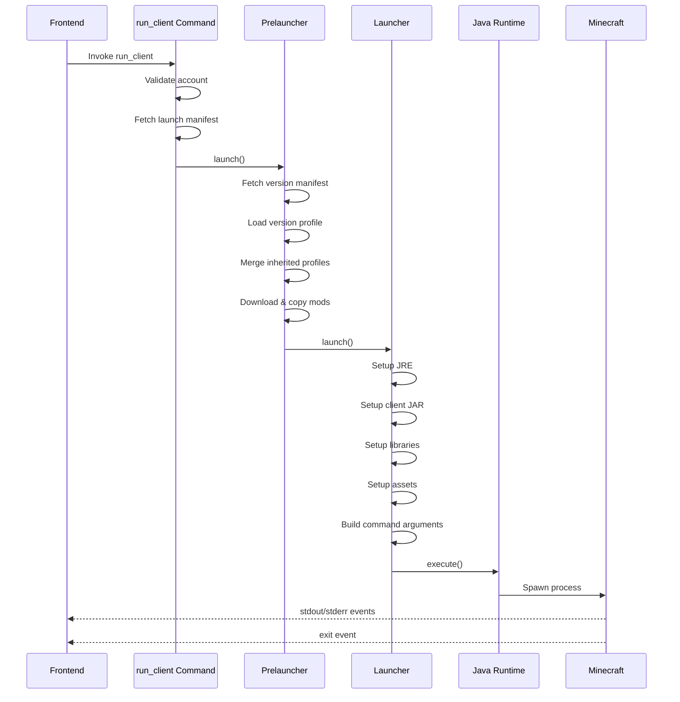

The launcher core is responsible for preparing and launching the Minecraft client. This involves downloading assets, libraries, and mods, setting up the Java runtime, and constructing the launch command.

## Launch Flow Overview



## Prelauncher

The prelauncher (`src-tauri/src/minecraft/prelauncher.rs`) handles pre-launch setup:

### Version Profile Loading

Version profiles define how to launch a specific Minecraft version:

<Steps>

### 1. Fetch Version Manifest

Load the Minecraft version manifest from Mojang:

```rust title="src-tauri/src/minecraft/prelauncher.rs:57-65"
let mc_version_manifest = VersionManifest::fetch
    .retry(ExponentialBuilder::default())
    .notify(|err, dur| {
        launcher_data.log(&format!(
            "Failed to load version manifest. Retrying in {:?}. Error: {}",
            dur, err
        ));
    })
    .await?;
```

### 2. Load Loader Manifest

Construct the loader-specific manifest URL (Fabric or Forge):

```rust title="src-tauri/src/minecraft/prelauncher.rs:105-122"
let manifest_url = match subsystem {
    LoaderSubsystem::Fabric { manifest, .. } => manifest
        .replace("{MINECRAFT_VERSION}", &build.mc_version)
        .replace(
            "{FABRIC_LOADER_VERSION}",
            &build.subsystem_specific_data.fabric_loader_version,
        ),
    LoaderSubsystem::Forge { manifest, .. } => manifest.clone(),
};

let mut version = (|| async { VersionProfile::load(&manifest_url).await })
    .retry(ExponentialBuilder::default())
    .await?;
```

### 3. Merge Inherited Profiles

Many loaders inherit from base Minecraft versions:

```rust title="src-tauri/src/minecraft/prelauncher.rs:124-156"
if let Some(inherited_version) = &version.inherits_from {
    let url = mc_version_manifest
        .versions
        .iter()
        .find(|x| &x.id == inherited_version)
        .map(|x| &x.url)
        .ok_or_else(|| {
            LauncherError::InvalidVersionProfile(format!(
                "unable to find inherited version manifest {}",
                inherited_version
            ))
        })?;
    
    let parent_version = (|| async { VersionProfile::load(url).await })
        .retry(ExponentialBuilder::default())
        .await?;
    
    version.merge(parent_version)?;
}
```

</Steps>

### Version Profile Structure

Version profiles are JSON files that describe:

```rust title="src-tauri/src/minecraft/version.rs:81-101"
pub struct VersionProfile {
    pub id: String,
    pub asset_index_location: Option<AssetIndexLocation>,
    pub assets: Option<String>,
    pub inherits_from: Option<String>,
    pub minimum_launcher_version: Option<i32>,
    pub downloads: Option<Downloads>,
    pub compliance_level: Option<i32>,
    pub libraries: Vec<Library>,
    pub main_class: Option<String>,
    pub logging: Option<Logging>,
    pub version_type: String,
    pub arguments: ArgumentDeclaration,
}
```

<Note>
Version profiles can inherit from other profiles. For example, Fabric 1.20.1 inherits from vanilla Minecraft 1.20.1.
</Note>

### Mod Management

The prelauncher handles mod downloading and installation:

<Accordion title="Mod Download Process">

```rust title="src-tauri/src/minecraft/prelauncher.rs:84-102"
// Clear old mods
clear_mods(&data_directory, &launch_manifest).await?;

// Download and copy manifest mods
retrieve_and_copy_mods(
    &data_directory,
    &launch_manifest,
    &launch_manifest.mods,
    client,
    retriever_account,
    &launcher_data,
).await?;

// Download and copy additional mods
retrieve_and_copy_mods(
    &data_directory,
    &launch_manifest,
    &additional_mods,
    client,
    retriever_account,
    &launcher_data,
).await?;
```

Mods can come from multiple sources:
- **Repository**: Maven-style artifact download
- **SkipAd**: Ad-supported download with premium bypass
- **Local**: Custom user-installed mods

</Accordion>

## Launcher Core

The launcher (`src-tauri/src/minecraft/launcher/mod.rs`) executes the launch process:

### Launch Parameters

All launch configuration is passed via `StartParameter`:

```rust title="src-tauri/src/minecraft/launcher/mod.rs:263-279"
pub struct StartParameter {
    pub java_distribution: DistributionSelection,
    pub jvm_args: Vec<String>,
    pub memory: u64,
    pub custom_data_path: Option<String>,
    pub auth_player_name: String,
    pub auth_uuid: String,
    pub auth_access_token: String,
    pub auth_xuid: String,
    pub clientid: String,
    pub user_type: String,
    pub keep_launcher_open: bool,
    pub concurrent_downloads: u32,
    pub client: Client,
    pub client_account: Option<ClientAccount>,
    pub skip_advertisement: bool,
}
```

### Directory Setup

The launcher creates necessary directories:

```rust title="src-tauri/src/minecraft/launcher/mod.rs:99-104"
let runtimes_folder = join_and_mkdir!(data, "runtimes");
let client_folder = join_and_mkdir_vec!(data, vec!["versions", &version_profile.id]);
let natives_folder = join_and_mkdir!(client_folder, "natives");
let libraries_folder = join_and_mkdir!(data, "libraries");
let assets_folder = join_and_mkdir!(data, "assets");
let game_dir = join_and_mkdir_vec!(data, vec!["gameDir", &*manifest.build.branch]);
```

### Java Runtime Setup

The launcher ensures the correct Java version is available:

```rust title="src-tauri/src/minecraft/launcher/mod.rs:106-118"
let java_bin = load_jre(
    &runtimes_folder,
    &manifest,
    &launching_parameter,
    &launcher_data,
)
.await
.context("Failed to load JRE")?;

launcher_data.log(&format!("Java Path: {:?}", java_bin));
if !java_bin.exists() {
    bail!("Java binary not found");
}
```

<Accordion title="Java Runtime Detection">

The JRE loader (`src-tauri/src/minecraft/launcher/jre.rs`) handles:

1. **Distribution Selection**: Checks which Java distribution to use (Adoptium, Azul, etc.)
2. **Version Detection**: Determines required Java version from manifest
3. **Download**: Downloads JRE if not present
4. **Extraction**: Extracts JRE archive
5. **Path Resolution**: Returns path to java/javaw binary

</Accordion>

### Client JAR Setup

```rust title="src-tauri/src/minecraft/launcher/mod.rs:120-129"
setup_client_jar(
    &client_folder,
    &natives_folder,
    &version_profile,
    &launcher_data,
    &mut class_path,
)
.await
.context("Failed to setup client JAR")?;
```

This downloads the Minecraft client JAR and adds it to the classpath.

### Library Setup

```rust title="src-tauri/src/minecraft/launcher/mod.rs:131-142"
setup_libraries(
    &libraries_folder,
    &natives_folder,
    &version_profile,
    &launching_parameter,
    &launcher_data,
    &features,
    &mut class_path,
)
.await
.context("Failed to setup libraries")?;
```

<Accordion title="Library Download Logic">

Libraries are downloaded from Maven repositories:

```rust title="src-tauri/src/minecraft/version.rs:640-645"
pub async fn download(
    &self,
    name: &str,
    libraries_folder: PathBuf,
    progress: &impl ProgressReceiver,
) -> Result<PathBuf>
```

The process:
1. Check if library exists and SHA1 matches
2. Download if missing or checksum mismatch
3. Verify downloaded file's checksum
4. Extract natives (platform-specific DLLs/SOs)
5. Add to classpath

</Accordion>

### Asset Setup

```rust title="src-tauri/src/minecraft/launcher/mod.rs:144-152"
let asset_index_location = setup_assets(
    &assets_folder,
    &version_profile,
    &launching_parameter,
    &launcher_data,
)
.await
.context("Failed to setup assets")?;
```

Assets include sounds, textures, and language files.

## Command Construction

The launcher builds the Java command with all necessary arguments:

### JVM Arguments

```rust title="src-tauri/src/minecraft/launcher/mod.rs:160-178"
// JVM Args
version_profile.arguments.add_jvm_args_to_vec(
    &mut command_arguments,
    &launching_parameter,
    &features,
)?;

// Launcher Args (-D<name>=<value>)
command_arguments.push(format!(
    "-Dnet.ccbluex.liquidbounce.api.url={}", 
    launching_parameter.client.url()
));
command_arguments.push(format!(
    "-Dnet.ccbluex.liquidbounce.api.secure={}", 
    launching_parameter.client.is_secure()
));
command_arguments.push(format!(
    "-Dnet.ccbluex.liquidbounce.api.token={}", 
    launching_parameter.client.session_token()
));
```

Default JVM arguments from `src-tauri/src/minecraft/version.rs:232-238`:

```rust
command_arguments.push(format!("-Xmx{}M", parameter.memory));
command_arguments.push("-XX:+UnlockExperimentalVMOptions".to_string());
command_arguments.push("-XX:+UseG1GC".to_string());
command_arguments.push("-XX:G1NewSizePercent=20".to_string());
command_arguments.push("-XX:G1ReservePercent=20".to_string());
command_arguments.push("-XX:MaxGCPauseMillis=50".to_string());
command_arguments.push("-XX:G1HeapRegionSize=32M".to_string());
```

### Main Class

```rust title="src-tauri/src/minecraft/launcher/mod.rs:180-189"
command_arguments.push(
    version_profile
        .main_class
        .as_ref()
        .ok_or_else(|| {
            LauncherError::InvalidVersionProfile("Main class unspecified".to_string())
        })?
        .to_owned(),
);
```

### Game Arguments

```rust title="src-tauri/src/minecraft/launcher/mod.rs:191-194"
version_profile
    .arguments
    .add_game_args_to_vec(&mut command_arguments, &features)?;
```

### Template Processing

Arguments contain templates like `${game_directory}` that must be replaced:

```rust title="src-tauri/src/minecraft/launcher/mod.rs:198-228"
for x in command_arguments.iter() {
    mapped.push(process_templates(x, |output, param| {
        match param {
            "auth_player_name" => output.push_str(&launching_parameter.auth_player_name),
            "version_name" => output.push_str(&version_profile.id),
            "game_directory" => {
                output.push_str(game_dir.absolutize().unwrap().to_str().unwrap())
            }
            "assets_root" => {
                output.push_str(assets_folder.absolutize().unwrap().to_str().unwrap())
            }
            "assets_index_name" => output.push_str(&asset_index_location.id),
            "auth_uuid" => output.push_str(&launching_parameter.auth_uuid),
            "auth_access_token" => output.push_str(&launching_parameter.auth_access_token),
            "user_type" => output.push_str(&launching_parameter.user_type),
            "version_type" => output.push_str(&version_profile.version_type),
            "natives_directory" => {
                output.push_str(natives_folder.absolutize().unwrap().to_str().unwrap())
            }
            "launcher_name" => output.push_str("LiquidLauncher"),
            "launcher_version" => output.push_str(LAUNCHER_VERSION),
            "classpath" => output.push_str(&class_path),
            "user_properties" => output.push_str("{}"),
            "clientid" => output.push_str(&launching_parameter.clientid),
            "auth_xuid" => output.push_str(&launching_parameter.auth_xuid),
            _ => return Err(LauncherError::UnknownTemplateParameter(param.to_owned()).into()),
        };
        Ok(())
    })?)
}
```

## Process Execution

The final step is spawning the Java process:

### Spawning the Process

```rust title="src-tauri/src/minecraft/launcher/mod.rs:233-235"
let mut running_task = java_runtime.execute(mapped, &game_dir).await?;
```

The `JavaRuntime` wrapper (`src-tauri/src/minecraft/java/runtime.rs`):

```rust title="src-tauri/src/minecraft/java/runtime.rs:34-48"
pub async fn execute(&self, arguments: Vec<String>, game_dir: &Path) -> Result<Child> {
    if !self.0.exists() {
        bail!("Java runtime not found at: {}", self.0.display());
    }
    
    debug!("Executing Java runtime: {}", self.0.display());
    
    let mut command = Command::new(&self.0);
    command.current_dir(game_dir);
    command.args(arguments);
    command.stderr(Stdio::piped()).stdout(Stdio::piped());
    
    let child = command.spawn()?;
    Ok(child)
}
```

### I/O Handling

The launcher streams stdout/stderr to the UI:

```rust title="src-tauri/src/minecraft/java/runtime.rs:67-88"
loop {
    tokio::select! {
        read_len = stdout.read(&mut stdout_buf) => {
            let _ = on_stdout(&data, &stdout_buf[..read_len?]);
        },
        read_len = stderr.read(&mut stderr_buf) => {
            let _ = on_stderr(&data, &stderr_buf[..read_len?]);
        },
        _ = &mut terminator => {
            running_task.kill().await?;
            break;
        },
        exit_status = running_task.wait() => {
            let code = exit_status?.code().unwrap_or(7900);
            debug!("Process exited with code: {}", code);
            if code != 0 && code != -1073740791 {
                bail!("Process exited with non-zero exit code: {}.", code);
            }
            break;
        },
    }
}
```

<Note>
The `tokio::select!` macro allows concurrent handling of multiple async operations: reading stdout, reading stderr, waiting for termination signal, and waiting for process exit.
</Note>

### Window Management

```rust title="src-tauri/src/minecraft/launcher/mod.rs:237-240"
if !launching_parameter.keep_launcher_open {
    // Hide launcher window
    launcher_data.hide_window();
}
```

After launch, the launcher can either:
- Hide and restore on game exit
- Stay visible to show logs

## Progress Tracking

The launcher reports progress through the `ProgressReceiver` trait:

```rust
pub trait ProgressReceiver {
    fn progress_update(&self, progress_update: ProgressUpdate);
    fn log(&self, msg: &str);
}
```

Progress updates include:
- **SetLabel**: Status message ("Downloading assets...")
- **SetProgress**: Numeric progress (0-100)
- **SetToMax**: Set progress to maximum
- **SetForStep**: Progress for a specific step

## Error Handling

The launch process uses comprehensive error handling:

```rust
launcher::launch(
    &data_directory,
    launch_manifest,
    version,
    launching_parameter,
    launcher_data,
)
.await
.context("Launch failed")?;
```

Each stage can fail and propagate errors:
- Network failures (manifest/library download)
- File system errors (permissions, disk space)
- Process spawn failures (Java not found)
- Runtime errors (incompatible Java version)

## Launch Example

A complete launch command might look like:

```bash
/path/to/java \
  -Xmx4096M \
  -XX:+UseG1GC \
  -Djava.library.path=/path/to/natives \
  -Dnet.ccbluex.liquidbounce.api.url=https://api.liquidbounce.net \
  -cp /path/to/libs/*.jar:/path/to/client.jar \
  net.minecraft.client.main.Main \
  --username Player \
  --version 1.20.1 \
  --gameDir /path/to/gameDir \
  --assetsDir /path/to/assets \
  --assetIndex 1.20 \
  --uuid 12345678-1234-1234-1234-123456789012 \
  --accessToken <token> \
  --userType msa
```

## Best Practices

<Note>
**Always verify checksums** - Libraries and assets should be verified against SHA1 hashes
</Note>

<Note>
**Use retry logic** - Network operations should retry with exponential backoff
</Note>

<Note>
**Report progress** - Keep the user informed during long operations
</Note>

<Note>
**Handle process lifecycle** - Properly manage process termination and cleanup
</Note>

<Note>
**Merge version profiles correctly** - Respect inheritance hierarchy when merging profiles
</Note>

## Next Steps

<CardGroup cols={2}>
  <Card title="Backend Architecture" icon="rust" href="/development/architecture/backend">
    Learn about Rust modules and command structure
  </Card>
  <Card title="Frontend Architecture" icon="code" href="/development/architecture/frontend">
    Explore Svelte components and UI
  </Card>
</CardGroup>