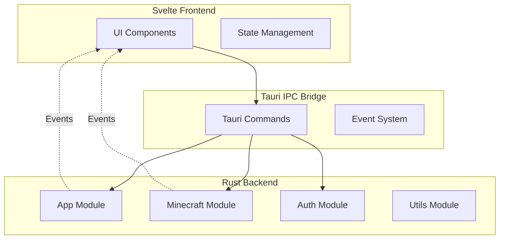

LiquidLauncher is built using the **Tauri framework**, combining a Rust backend with a Svelte frontend to create a fast, secure, and lightweight Minecraft launcher.

## Technology Stack

LiquidLauncher uses a modern technology stack designed for performance and cross-platform compatibility:

- **Backend**: Rust with Tauri framework
- **Frontend**: Svelte with Vite
- **Communication**: Tauri IPC (Inter-Process Communication)
- **Build System**: Cargo (Rust) and npm/bun (JavaScript)

## Tauri Architecture

Tauri provides a hybrid architecture that separates concerns between system-level operations and user interface:



## Module Organization

The codebase is organized into clear, functional modules:

### Backend Modules (src-tauri/src/)

<Accordion title="Core Modules">

#### main.rs
Application entry point that initializes:
- Logging system (file and console output)
- Application directories
- Tauri GUI framework

Relevant code from `src-tauri/src/main.rs:64-110`:

```rust
pub fn main() -> Result<()> {
    // Setup logging with file rotation
    let logs = LAUNCHER_DIRECTORY.data_dir().join("logs");
    utils::clean_directory(&logs, 7)?;
    let file_appender = tracing_appender::rolling::daily(logs, "launcher.log");
    
    // Initialize directories
    mkdir!(LAUNCHER_DIRECTORY.data_dir());
    mkdir!(LAUNCHER_DIRECTORY.config_dir());
    
    // Start GUI
    gui_main();
    Ok(())
}
```

#### app/
Handles GUI integration and application state:
- `gui/` - Tauri command handlers and window management
- `client_api.rs` - LiquidBounce API client
- `options.rs` - User settings and configuration
- `webview.rs` - WebView utilities

#### minecraft/
Core launcher functionality:
- `launcher/` - Launch process and game setup
- `version.rs` - Version manifest parsing
- `auth.rs` - Minecraft authentication
- `prelauncher.rs` - Pre-launch setup (mods, assets)
- `java/` - Java runtime management

#### auth/
Authentication systems for Minecraft accounts (Microsoft, offline)

#### utils/
Shared utilities:
- `download.rs` - File downloading with progress
- `checksum.rs` - SHA1 verification
- `extract.rs` - Archive extraction
- `maven.rs` - Maven artifact resolution
- `sys.rs` - System information detection

</Accordion>

### Frontend Structure (src/)

<Accordion title="Frontend Components">

#### App.svelte
Root component that bootstraps the application

#### lib/Window.svelte
Main window component managing application state:
- Options loading and storage
- API client setup
- System checks
- Update handling
- Screen routing (Login → Main)

#### lib/main/
Main launcher screens:
- `MainScreen.svelte` - Primary interface
- `LaunchArea.svelte` - Launch button and controls
- `VersionSelect.svelte` - Version picker
- `settings/` - Settings panels
- `log/` - Client log viewer
- `news/` - News feed
- `statusbar/` - Progress indicators

#### lib/login/
Authentication interface:
- `LoginScreen.svelte` - Login view
- `loginmodal/` - Login modal components

#### lib/settings/
Reusable settings components (sliders, selectors, inputs)

#### lib/common/
Shared UI components (buttons, tooltips, title bar)

</Accordion>

## Communication Flow

The frontend and backend communicate through Tauri's IPC system:

<Steps>

### Frontend Invokes Command
User interaction triggers a Tauri command invocation:

```javascript
import { invoke } from "@tauri-apps/api/core";

const options = await invoke("get_options");
```

### Tauri Routes to Handler
Tauri deserializes parameters and routes to the Rust command handler:

```rust
#[tauri::command]
pub async fn get_options() -> Result<Options, String> {
    // Handler implementation
}
```

### Backend Processes Request
Rust code executes system operations, file I/O, network requests, etc.

### Backend Emits Events
For async updates, the backend emits events to the frontend:

```rust
window.emit("progress-update", &progress_update)?;
```

### Frontend Listens for Events
Svelte components subscribe to events:

```javascript
import { listen } from "@tauri-apps/api/event";

listen("progress-update", (event) => {
    console.log("Progress:", event.payload);
});
```

</Steps>

## Application Lifecycle

<Steps>

### 1. Initialization
- Application starts from `main.rs:64`
- Logging system configured
- Directories created
- GUI launched via `gui_main()`

### 2. Frontend Bootstrap
- `Window.svelte` mounts
- Options loaded from disk
- API client configured
- System compatibility checked
- Update check performed

### 3. Authentication
- If no account: Show `LoginScreen`
- User logs in (Microsoft or offline)
- Account stored in options

### 4. Main Interface
- `MainScreen` displays
- Branches and builds fetched from API
- User selects version and configures settings

### 5. Launch Process
- `run_client` command invoked (src-tauri/src/app/gui/commands/client.rs:260)
- Version manifest downloaded
- Assets, libraries, and mods downloaded
- Java runtime prepared
- Game process spawned
- Logs streamed to UI

### 6. Post-Launch
- Launcher hidden (optional)
- Game output monitored
- Process termination handled
- Launcher restored on exit

</Steps>

## Directory Structure

```
LiquidLauncher/
├── src-tauri/              # Rust backend
│   ├── src/
│   │   ├── main.rs         # Entry point
│   │   ├── app/            # Application layer
│   │   ├── minecraft/      # Minecraft logic
│   │   ├── auth/           # Authentication
│   │   └── utils/          # Utilities
│   ├── Cargo.toml          # Rust dependencies
│   └── tauri.conf.json     # Tauri configuration
├── src/                    # Svelte frontend
│   ├── App.svelte          # Root component
│   └── lib/                # Component library
│       ├── Window.svelte   # Main window
│       ├── main/           # Main screens
│       ├── login/          # Login screens
│       ├── settings/       # Settings components
│       └── common/         # Shared components
├── package.json            # JS dependencies
└── vite.config.js          # Vite configuration
```

## Key Design Principles

<Note>
**Separation of Concerns**: The Rust backend handles all system operations, file I/O, and network requests, while the Svelte frontend focuses purely on UI and user interaction.
</Note>

<Note>
**Type Safety**: Tauri's command system ensures type-safe communication between frontend and backend through serialization/deserialization.
</Note>

<Note>
**Async-First**: Both frontend (JavaScript promises) and backend (Tokio async) are designed around asynchronous operations for responsive UI.
</Note>

<Note>
**Error Handling**: Rust's `Result` type propagates errors through the stack, converted to JavaScript exceptions at the boundary.
</Note>

## Next Steps

<CardGroup cols={2}>
  <Card title="Backend Architecture" icon="rust" href="./backend">
    Deep dive into Rust modules and Tauri commands
  </Card>
  <Card title="Frontend Architecture" icon="code" href="./frontend">
    Explore Svelte components and state management
  </Card>
  <Card title="Launcher Core" icon="rocket" href="./launcher-core">
    Understand the game launch process
  </Card>
</CardGroup>